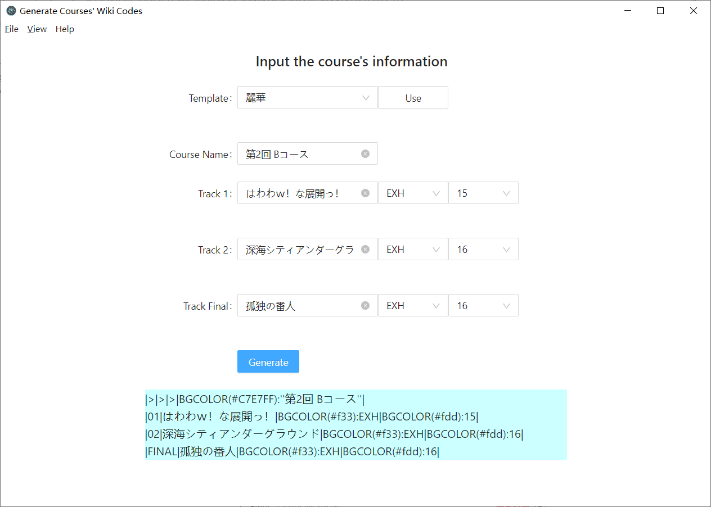

# SkillBunSeki

A GUI tool to generate wiki source codes for [BEMANIWIKI SDVXV SKILL ANALYZER page](https://bemaniwiki.com/index.php?SOUND%20VOLTEX%20VIVID%20WAVE/SKILL%20ANALYZER).

## Usage

- Input the course name and 3 tracks information of the course.
- Click the `Use` button to use a course template, which can automatically generate the difficulties and levels (It's just a template, you should check and modify some course by yourself).
- Click the `Add` button to add a course to the list and get the wiki codes.
- Click the `Batch Generate` button to generate all the courses' (in the list) wiki codes.
- Click the `Reset` button to reset all the inputs.



## TODOs

- [x] Provide some templates.
- [x] Batch generate courses.
- [ ] Beautify the UI.
- [ ] Make it more ergonomic.


## Develop

This app is developed with electron and React. This project is generated by the template: https://github.com/electron-react-boilerplate/electron-react-boilerplate

### Start in Dev Mode

```bash
yarn
yarn start
```

### Pack 

```bash
yarn package
```
